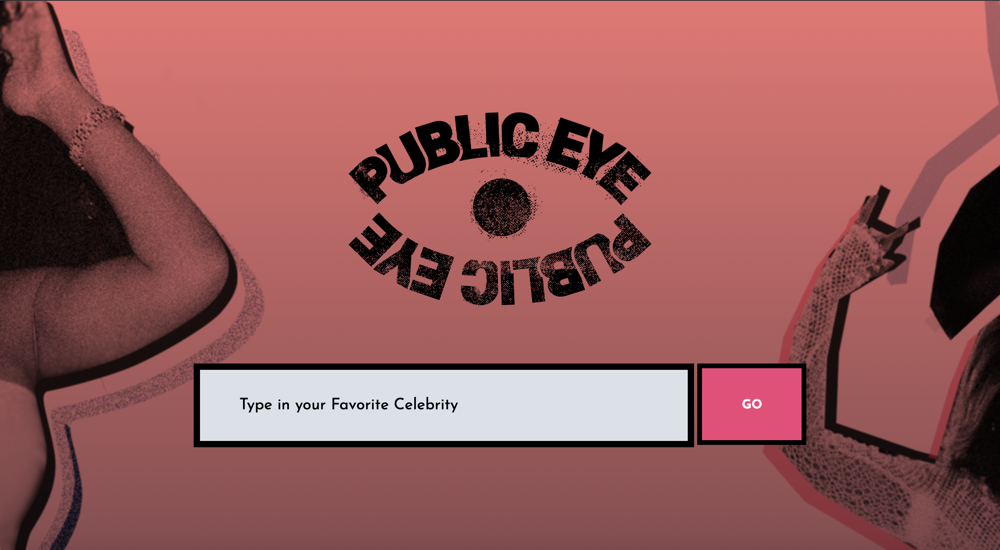

# Project_1
SMU Project 1 2019
Working collaboratively With a team, you will conceive and execute a design that solves a real-world problem by integrating data received from multiple server-side API requests. Application must integrate two API requests.

Click the link for a live demo:
https://marcusmaximusiv.github.io/Project_1/

### PUBLIC EYE APP
In a social media driven world, wouldn’t it be great if you could track your favorite famous people all in one spot?
This interactive app allows users to collect data by utilizing various: 
-API’s 
-Social Media Accounts 
-Fun interactive photos 

## Technologies Used:
1. Giphy API - Displays short animated images
2. Youtube API - Pulls #1 video and plays within browser
3. Etsy API - Pulls top 16 items on Etsy related to user search. Can click each shoppable item to purchase item.
4. Advice Slip API - Displays a quote based on user search
5. Twitter & Facebook API - Opening in a new tab, the users input populate recent tweets and articles within Facebook and Twitter browser 

